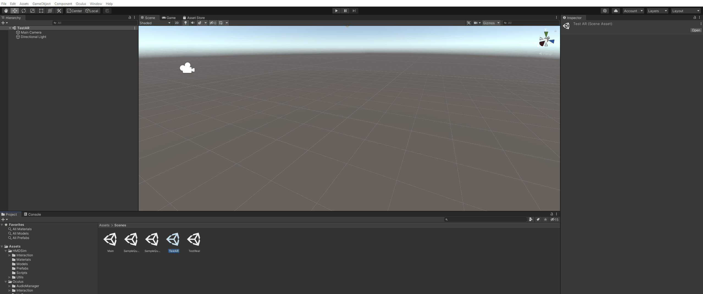

# ARVR Simulator Tutorial By Example (Oculus Version)
## Example#1: Setting Up Development Environment

### Initial Steps
1. Clone directory from Github Repository and open in Unity 2019.4.25
2. Create two scenes with the following scene names: “TestAR” and “TestReal” (or any name as long as the two scenes have the same prefix and “AR” and “Real” as their suffixes (eg. “ExampleAR” and “ExampleReal”)

### AR Scene (scene with “AR” suffix)
3. Switch to AR Scene (scene with “AR” suffix).
4. Delete the Directional Light and Camera object from the Hierarchy menu.
5. Drag the “OVRSetAR” Prefab from the Assets directory into the Hierarchy menu.
6. Create a reasonable-sized cube object in the AR Scene (preferably located on the origin) by right-clicking the hierarchy menu and selecting 3D object→Cube.
7. Drag the “TrackedObject” Script from the “Scripts” directory and drop it on the cube to apply the cube with the TrackedObject behavior.
8. In the Inspector for the cube object, edit the TrackerName property to a unique name (eg. “Cube1”).
9. Go to Build Settings from the File tab on the top left, and click on “Add Open Scenes” to add the AR Scene to the build.

### Real Scene (Scene with “Real” suffix)
10. Switch to Real Scene (Scene with “Real” suffix).
11. Create a stationary object for the player to stand on (eg. Cube with scale 10, 0.5, 10)
12. Drag the “OVRSetReal” Prefab from Assets into the Hierarchy menu in the Real Scene.
13. Create a reasonable-sized cube object in the Real Scene in front of the CameraRig object.
14. Drag the “GenericTrackerBehavior” Script from the “Scripts” directory and drop it on the cube to apply the cube with the GenericTrackerBehavior.
15. In the Inspector for the cube object, edit the TrackerName property to the same name used for the TrackedObject behavior’s TrackerName property.
16. Go to Build Settings from the File tab on the top left, and click on “Add Open Scenes” to add the Real Scene to the build.

### Scene named “Main”
17. Switch to the Scene named “Main” under the “Scenes” directory.
18. Click on the Main_HMDSimulatorManager object in the Hierarchy menu and under the “MainManager” script in the Inspector menu, edit the Scene Prefix property to match the prefix you have used for the two scenes (for this example we used “Test” unless you decided otherwise)
19. Play the Scene and you should see a pair of lenses in your sight that shows a virtual cube overlaying on the cube in front of you.

## Example#2: Adding Latency
1. Switch to Real Scene (scene with "Real" Suffix) for the example you created in Example#1.
2. Open the Inspector for the cube.
3. Change the value in the "Buffer Limit" parameter to desired buffer (latency). For this example, we can set it to 800.
4. 